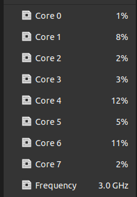
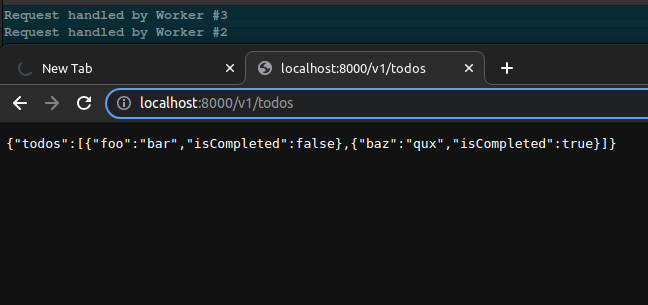

## Simple Node.js multi-process

####  A super simple Node.js multi-process API setup:

 - Parallelize your API
 - Simple boilerplate to get started
 - Deploy 1 app over a single port

#### Try it

`npm start`

`http://localhost:8000/v1/todos`

#### How it works

A very simple server recursively handles requests.

On load, the server is treated as a "primary" node that forks 1 copy of itself for every CPU available.

The copies run the same logic in `index.js` in parallel as needed, each listening for `GET` and `POST` requests (in this example).
That means if you run this on a machine with an 8-core CPU, the first instance will spawn 7 other copies, and manage all of their lifecycle events (`onExit` etc.).

**Note that "multi-process" is not the same as "multi-threaded"**

> The main difference is that when resource requirements are low, multiple processes can still run on a single CPU core thread, especially if the OS is doing something else more expensive than what your app is doing. But if your app is the hungriest for CPU on that machine, it will spread the work across more cores.

> There's no guarantee that it will run 1 process per core until you start to push the machine to its limit - at that point each process would work in its own core. That's the point of limiting `numCPUs` to the number of CPU cores available. It's pretty graceful, as it's like using the OS as a load balancer. Of course, Node.js can scale and run many more processes in parallel than the number of available CPU cores, but it isn't recommended for a few reasons.

> The effects of heavy traffic, DDoS attacks, and uncaught errors are minimized by handing off excess work to available workers

> Non-blocking IO: The first tab (using Worker #3) is sending an unhandled erroneous request that causes the process to hang, while the second tab is still able to use the API via another worker (Worker #2)

#### What are use cases for doing it this way?

**When you want CPU-bound instances in the cloud**

It's more efficient to run a single project served over a single port that manages its own resources ("vertical scaling"), rather than using platform tools to scale out copies the moment you need more resources ("horizontal scaling"). In a cloud platform like AWS or GCP, you can allocate up to something like 96 CPUs per instance. With an API cluster designed in this way, you can take full advantage of what these cloud platforms offer and cut a lot of unnecessary costs.

**When you don't want to mess with Kubernetes or cloud at all because it's all just devops hell!**

For on-prem, this is a very easy scaling option that uses native Node.js utilities that leverage your OS' capabilities, without having to set up Kubernetes or any other orchestration software.

**For networks other than worldwide web (robots, etc.)**

If you are running a simple web API on a non-conventional web server that needs to receive web requests at scale, like on a Raspberry Pi for a robot or other device, this is a simple way to take full advantage of that device's multi-core CPU.

**It's cheap, easy, light, and fast - so why not?**

This is just a native Node.js implementation (0 dependencies) derived from their documented cluster example, set up for scale. I appreciate the power and flexibility that Node.js comes with out of the box: When resource requirements are low, it can naturally fall back to just using 1 worker to handle requests, and only when web traffic intensifies do other workers go online, taking on the excess requests.

**"Sounds cool, but I like Express.js" or "I need WebSockets"**

If you want to use an API framework like Express, replace all the code in `/api/index.js` with your router and framework entry (ex. in Express: Your `app.get()`, `app.post()`, etc. handlers would go here). For a WebSockets server, your `ApiGateway` would need to be modified to support message passing instead of HTTP requests. Other than that, it can work with either library.

- Express.js Example (TBD)

- Socket.io Example (TBD)
