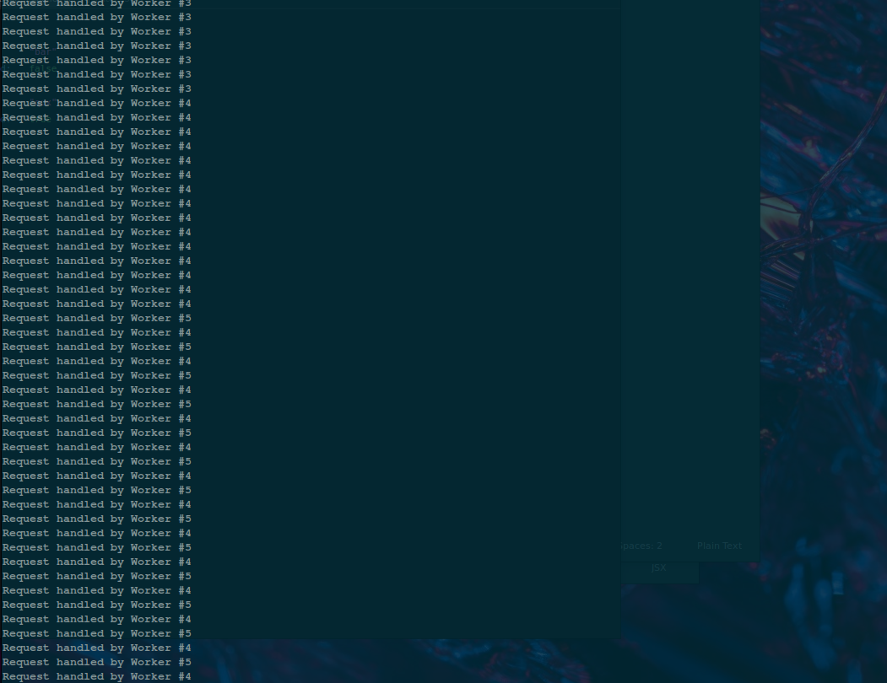

 # Simple Node.js multi-process

 #####  A super simple Node.js multi-process API setup:

 - Parallelize your API
 - Simple boilerplate to get started
 - Deploy 1 app over a single port

##### Try it

`npm start`

`http://localhost:8000/v1/todos`

##### How it works

A very simple server recursively handles requests.

On load, the server is treated as a "primary" node that forks 1 copy of itself for every CPU available.

The copies run the same logic in `index.js` in parallel as needed, each creating HTTP servers and listening for `GET` and `POST` requests (in this example).
That means if you run this on a machine with an 8-core CPU, the first instance will spawn 7 other copies, and manage all of their lifecycle events (`onExit` etc.).

**Note that "multi-process" is not the same as "multi-threaded"**

> The main difference is that when resource requirements are low, multiple processes can still run on a single CPU core thread, especially if the OS is doing something else more expensive than what your app is doing. But if your app is the hungriest for CPU on that machine, it will spread the work across more cores.

> There's no guarantee that it will run 1 process per core until you start to push the machine to its limit - at that point each process would work in its own core. That's the point of limiting `numCPUs` to the number of CPU cores available. It's pretty graceful, as it's like using the OS as a load balancer. Of course, Node.js can scale and run many more processes in parallel than the number of available CPU cores, but it isn't recommended for a few reasons.

> Heavy traffic (or a DDoS attack) is handled by handing off excess work to available workers

##### What's are use cases for doing it this way?

**When you want to auto-scale available resources independent of using tools to scale entire apps**

You can often cut costs on cloud platforms by running a single project served over a single port that manages its own resources ("vertical scaling"), rather than using platform tools and interfaces to scale out your instances ("horizontal scaling").

**For networks other than worldwide web (robots, etc.)**

If you are running a simple web server, perhaps on a Raspberry Pi for a robot, or some other non-traditional computing hardware that needs to receive web requests at scale.

**It's cheaper, easier, lighter, and faster - so why not?**

This is a simple boilerplate for anyone who wants to build a Node.js API that doesn't want to get lost in a framework, dev ops, or cloud provider configurations. This is just a native Node.js implementation (0 dependencies) derived from their provided example, set up for scale.
